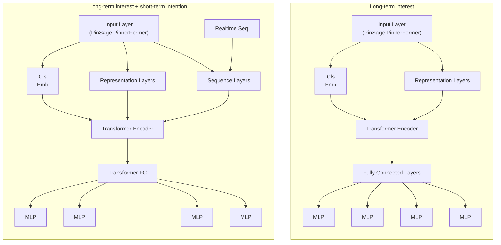

# Recommendation Systems

## Production Level Systems

### ByteDance's Monolith

[Paper](https://arxiv.org/pdf/2209.07663)

In the paper, ByteDance present "Monolith" a production level recommendation algorithm which is likely what powers TikTok. They talk about what it takes to get an embedding model based recommendation system to work at such high volume, but also update realtime to the users preferences.

Essentially, all actions along with the features upon which those actions happened are collected and stored in their training data. A training worker trains the recommendation model on the collected data, updating the 'Training Paramter Store' after each backward pass. Periodically, these parameters are syncronized to the 'Serving Paramter Store', which will recommend to the user the next relevant thing.

This synchronization happens in a different way for sparse and dense parameters. They found that sparse parameters dominate the size of the recommendation models, so they consistnely sync these parameters, while updating dense parameters less frequently.

It seems as if they give out 'embeddings' to IDs, which I can assume is people, and therefore can associate content embeddings to people embeddings in order to recommend certain content.

Fault - Tolerance is achieved by snapshotting the parameter store once per day. They foun d that this was a suitable tradeoff between computation overhead and model quality, since the model does not change significantly across a 24 hour period.

## Rethinking Personalised Ranking At Pinterest: An End-To-End Approach

[Paper](https://arxiv.org/pdf/2209.08435)

In the paper, they introduce 'PinnerFormer' which is Pinterests user embedding model used to encode long-term user interest.

Each 'Pin' at Pinterest is represented with a PinSage Embedding, an aggregation of visual, text annotations and engagement information for each pin. PinnerFormer takes in a PinSage Embedding & a User Action.

Therefore, for each user, they collect all actions taken in the past year (limited to actions on Pins), and then use these actions (along with the respective PinSage Embd.) to compute a user embedding. To do so they use $M$ actions, with each $M$ attending to the actions that came before it (using causal masking).

The output of this is an embedding for each action, which is feed through an MLP to produce an embedding. They also learn a MLP that takes in PinSage embeddings to produce an output embedding. (These can now be compared).

They introduce a Loss function called 'DenseAllAction' loss, which means that they use all $M$ outputs (aka all user embeddings after each action) to predict all positive actions in the next 28 days.

This process allows for long-term interest prediction. Of course, they still need the realtime aspect, which is again a series of actions (with PinSage embd.) which is fed through a Multi-Head Self-Attention block (so that the recent events can attend to each other) before being passed into the TransformerEncoder layer along with the current PinnerFormer embedding.

